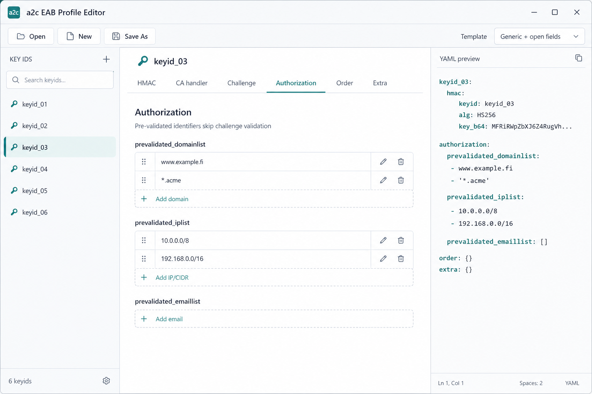
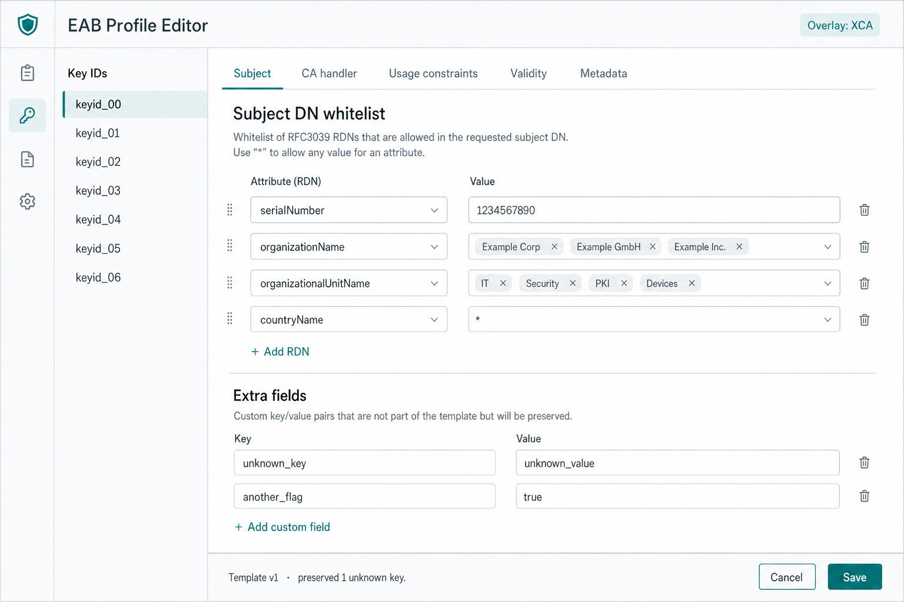

# a2c EAB Profile Editor

Desktop helper to create and maintain **YAML** enrollment profile files for [acme2certifier](https://github.com/grindsa/acme2certifier) **EAB profiling** (`kid_profile_handler` / `key_file`).

> **Status:** scaffold + design mockups. Implementation handoff for agents: see **[AGENTS.md](./AGENTS.md)**.

## Why

`kid_profiles` YAML/JSON maps an EAB `keyid` to HMAC material and optional per-account overrides (`cahandler`, `challenge`, `authorization`, …). Hand-editing grows error-prone as CA handlers add fields. This app provides a modern CRUD UI driven by a **versioned template file** so the form model can change without rewriting the UI.

Upstream docs: [Enrollment profiling via EAB](https://github.com/grindsa/acme2certifier/blob/master/docs/eab_profiling.md).

## Stack

- **Tauri 2** + **SvelteKit** (static SPA) + TypeScript
- Tailwind + shadcn-svelte
- Zod + template YAML
- Vitest / Playwright
- GitHub Actions releases (planned)

## Mockups

| Screen | Preview |
|--------|---------|
| Main editor |  |
| Authorization + YAML |  |
| Template source |  |
| Subject + extras |  |

## Layout

```text
a2c-eab-profile-editor/
  AGENTS.md                 # pick-up instructions for coding agents
  docs/mockups/             # UI mockups
  templates/                # default UI/data template + overlays
  src/                      # SvelteKit app (to implement)
  src-tauri/                # Tauri shell (to implement)
```

## Local development (once scaffolded)

```bash
cd a2c-eab-profile-editor
npm install
npm run tauri dev
```

## Separate repository

This directory is staged inside `acme2certifier` until a dedicated GitHub repo is created (automation token lacked `createRepository`). See **Repo hosting note** in `AGENTS.md`.

## License

Align with acme2certifier (GPL-3.0) unless the standalone repo maintainers choose otherwise before first release.
