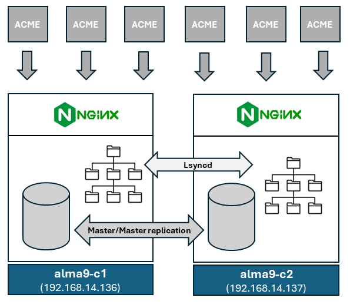

<!-- markdownlint-disable  MD013 -->

<!-- wiki-title How to build an acme2certifier cluster on Alma Linux 9 -->

# How to build an acme2certifier cluster on Alma Linux 9

This tutorial describes the configuration of a two-node acme2certifier cluster running in active/active configuration. Although both nodes are active at the same time and provide proxy services via different IP addresses, the database, configuration and and runtime objects will be replicated among the nodes.

This setup requires the switch to a different database engine as SQLite, which is the default a2c backend, is not designed to handle concurrent write access, which can happen in an active/active setup. Thus, [MariaDB](https://mariadb.org/) will be used. Configuration files and runtime objects will be replicated using [Lsyncd](https://github.com/lsyncd/lsyncd). The following diagram depicts the application stack to be used.



The guide is written for **Alma Linux 9**, however adapting to other Linux distributions or Red Hat derivatives should not be difficult. There is also a guide for [Ubuntu 22.04](a2c-ubuntu-loadbalancing.md) available

## Preparation

To set up the MariaDB Master-Master replication between multiple servers, you will need to ensure each system hostname is resolved to the correct IP address. I recommend setting up the FQDN in /etc/hosts on each server.

```cfg
cat /etc/hosts
...
192.168.14.136 alma9-c1.bar.local alma9-c1
192.168.14.137 alma9-c2.bar.local alma9-c2
```

Furthermore, the EPEL-repository need to be enabled on both nodes.

```bash
sudo yum install -y epel-release
sudo yum update -y
```

Stop the firewalld on both nodes

```bash
sudo systemctl stop firewalld
sudo systemctl disable firewalld
```

## Installation and configuration of MariaDB

The following instructions are based on [an existing tutorial](https://www.howtoforge.com/how-to-setup-mariadb-master-master-replication-on-debian-11/).

### Setting up alma9-c1

- install MariaDB-server

```bash
sudo yum install -y mariadb-server
```

- start MariaDB during startup

```bash
sudo systemctl enable mariadb
sudo systemctl status mariadb
```

- Modify `/etc/my.cnf.d/mariadb-server.cnf`, change the IP binding, and add the following lines

```cfg
# listen on external address
bind-address            = 192.168.14.136

server-id              = 1
report_host            = alma9-c1

log_bin                = /var/log/mariadb/mariadb-bin
log_bin_index          = /var/log/mariadb/mariadb-bin.index

relay_log              = /var/log/mariadb/relay-bin
relay_log_index        = /var/log/mariadb/relay-bin.index

# avoiding primary key collision
log-slave-updates
auto_increment_increment=2
auto_increment_offset=1
```

- restart MariaDB-server

```bash
sudo systemctl restart mariadb
```

- verify service binding

```bash
ss -plnt
State Recv-Q Send-Q        Local Address:Port       Peer Address:Port   Process
...
LISTEN   0        80           192.168.14.136:3306            0.0.0.0:*       users:(("mariadbd",pid=815,fd=43))
...
```

- open the MySQL command-line client

```bash
sudo mysql -u  root
```

- create the replication user

```SQL
CREATE USER 'replusr'@'%' IDENTIFIED BY 'replpasswd';
GRANT REPLICATION SLAVE ON *.* TO 'replusr'@'%';
FLUSH PRIVILEGES;
```

- Next, run the following query to check the current binary log and its exact position of it. In this example, the binary log file for the MariaDB server is "mariadb-bin.000001" with the position "773". These outputs will be used in the next stage for setting up the "alma9-c2" server.

```SQL
SHOW MASTER STATUS;
```

```SQL
+--------------------+----------+--------------+------------------+
| File               | Position | Binlog_Do_DB | Binlog_Ignore_DB |
+--------------------+----------+--------------+------------------+
| mariadb-bin.000001 |      773 |              |                  |
+--------------------+----------+--------------+------------------+
1 row in set (0.000 sec)
```

### Setting up alma9-c2

- install MariaDB-server

```bash
sudo yum install -y mariadb-server
```

- start MariaDB during startup

```bash
sudo systemctl enable mariadb
sudo systemctl status mariadb
```

- Modify `/etc/my.cnf.d/mariadb-server.cnf`, change the IP binding, and add the following lines

```cfg
# listen on external address
bind-address            = 192.168.14.137

server-id              = 2
report_host            = alma9-c2

log_bin                = /var/log/mariadb/mariadb-bin
log_bin_index          = /var/log/mariadb/mariadb-bin.index

relay_log              = /var/log/mariadb/relay-bin
relay_log_index        = /var/log/mariadb/relay-bin.index

# avoiding primary key collision
log-slave-updates
auto_increment_increment=2
auto_increment_offset=2
```

- restart MariaDB-server

```bash
sudo systemctl restart mariadb
```

- verify service binding

```bash
ss -plnt
```

```bash
State Recv-Q Send-Q        Local Address:Port       Peer Address:Port   Process
...
LISTEN   0        80           192.168.14.137:3306            0.0.0.0:*       users:(("mariadbd",pid=841,fd=41))
...
```

- open the MySQL command-line client

```bash
sudo mysql -u  root
```

- create the replication user

```SQL
CREATE USER 'replusr'@'%' IDENTIFIED BY 'replpasswd';
GRANT REPLICATION SLAVE ON *.* TO 'replusr'@'%';
FLUSH PRIVILEGES;
```

- stop the slave and add information about the alma9-c1 master node as well as the binlog file name ("mariadb-bin.000001") and position ("773") from alma9-c1.

```SQL
STOP SLAVE;
CHANGE MASTER TO MASTER_HOST='alma9-c1', MASTER_USER='replusr', MASTER_PASSWORD='replpasswd', MASTER_LOG_FILE='mariadb-bin.000001', MASTER_LOG_POS=773;
```

- start the slave again and verify the slave status on the "alma9-c2" server. You should get "Slave_IO_Running: Yes" and "Slave_SQL_Running: Yes",

```SQL
START SLAVE;
SHOW SLAVE STATUS\G
```

```SQL
*************************** 1. row ***************************
                Slave_IO_State: Waiting for master to send event
                   Master_Host: alma9-c1
...
              Slave_IO_Running: Yes
             Slave_SQL_Running: Yes
...
```

### Configure master-master replication on alma9-c1

- open the MySQL command-line client and create the replication user

```bash
sudo mysql -u  root
```

- stop the slave and add information about the alma9-c2 master node as well as the binlog file name and position.

```SQL
STOP SLAVE;
CHANGE MASTER TO MASTER_HOST='alma9-c2', MASTER_USER='replusr', MASTER_PASSWORD='replpasswd', MASTER_LOG_FILE='mariadb-bin.000001', MASTER_LOG_POS=773;
```

- start the slave again and verify the slave status

```SQL
START SLAVE;
SHOW SLAVE STATUS\G
```

```SQL
*************************** 1. row ***************************
                Slave_IO_State: Waiting for master to send event
                   Master_Host: alma9-c1
...
              Slave_IO_Running: Yes
             Slave_SQL_Running: Yes
...
```

### Test master-master replication

#### Test on alma9-c1

- open the mysql commandline client

```bash
sudo mysql -u  root
```

- create a testdatabase and a test-table

```SQL
CREATE DATABASE testdb;
```

#### test on alma9-c2

- open the mysql commandline client

```bash
sudo mysql -u  root
```

- check the databases created in previous step

```SQL
SHOW DATABASES;
```

```SQL
+--------------------+
| Database           |
+--------------------+
| information_schema |
| mysql              |
| performance_schema |
| testdb             |
+--------------------+
5 rows in set (0.000 sec)

MariaDB [(none)]>
```

- delete database

```SQL
DROP DATABASE testdb;
```

#### verification on alma9-c1

- back on alma9-c1 check the databases to make sure that "testdb" is not present anymore

```SQL
SHOW DATABASES;
```

```SQL
+--------------------+
| Database           |
+--------------------+
| information_schema |
| mysql              |
| performance_schema |
+--------------------+
4 rows in set (0.000 sec)

```

## Configure directory replication via Lsyncd

The following instructions are based on [an existing tutorial](https://docs.rackspace.com/docs/set-up-lsyncd-locally-and-over-ssh-to-sync-directories).

To accomplish a remote synchronization using Lsyncd, each node must have password-less SSH access to its peer. Further, it is recommended to use the root-user for synchronization to ensure that permissions, ownership, and group information of the synchronized objects will be preserved.

### on both nodes to be executed as root-user

- generate ssh keys

```bash
sudo ssh-keygen -t rsa -f /root/.ssh/id_lsyncd
```

- copy the newly created public key `/root/.ssh/id_lsyncd.pub` from each host to peer and add it to `/root/.ssh/authorized_keys` file

- create the acme2certifier directory to be synchronized between the two hosts

```bash
sudo mkdir -p /opt/acme2certifier/volume
```

- install Lsyncd

```bash
sudo yum install -y lsyncd
```

### configuration on alma9-c1

- test passwordless ssh access by logging in to alma9-c2

```bash
sudo ssh -i /root/.ssh/id_lsyncd root@alma9-c2
exit
```

- create a configuration file `/etc/lsyncd.conf` with the following content

```lua
settings {
  logfile = "/var/log/lsyncd/lsyncd.log",
  statusFile = "/var/log/lsyncd/lsyncd.status",
  statusInterval = 20,
  nodaemon   = false
}

sync {
  default.rsyncssh,
  source = "/opt/acme2certifier/volume/",
  host = "alma9-c2",
  targetdir = "/opt/acme2certifier/volume/",
  rsync = {
    rsh = "/usr/bin/ssh -l root -i /root/.ssh/id_lsyncd -o StrictHostKeyChecking=no",
    compress = true,
    owner = true,
    group = true,
    archive = true
 }
}
```

- start Lsyncd and enable automatic startup

```bash
sudo systemctl restart lsyncd
sudo systemctl enable lsyncd
```

### configuration on alma9-c2

- test passwordless ssh access by logging in to alma9-c1

```bash
sudo ssh -i /root/.ssh/id_lsyncd root@alma9-c1
```

- create a configuration file `/etc/lsyncd.conf` with the following content

```lua
settings {
  logfile = "/var/log/lsyncd/lsyncd.log",
  statusFile = "/var/log/lsyncd/lsyncd.status",
  statusInterval = 20,
  nodaemon   = false
}

sync {
  default.rsyncssh,
  source = "/opt/acme2certifier/volume/",
  host = "alma9-c1",
  targetdir = "/opt/acme2certifier/volume/",
  rsync = {
    rsh = "/usr/bin/ssh -l root -i /root/.ssh/id_lsyncd -o StrictHostKeyChecking=no",
    compress = true,
    owner = true,
    group = true,
    archive = true
 }
}
```

- start Lsyncd and enable automatic startup

```bash
sudo systemctl restart lsyncd
sudo systemctl enable lsyncd
```

### Test replication

#### test replication on alma9-c1

- create a file in `/opt/acme2certifier/volume` directory

```bash
sudo touch /opt/acme2certifier/volume/test.txt
```

#### test replication on alma9-c2

- verify that the '/opt/acme2certifier/volume/test.txt' has been synchronized to alma9-c2 (please note that replication can take up to 20s)

```bash
sudo ls -la /opt/acme2certifier/volume
```

- delete the '/opt/acme2certifier/volume/test.txt'

```bash
sudo rm /opt/acme2certifier/volume/test.txt
```

#### Verify deletion on alma9-c1

- back on alma9-c1 check `/opt/acme2certifier/volume` to make sure that "test.txt" has been deleted (please note that replication can take up to 20s)

```bash
sudo ls -la /opt/acme2certifier/volume
```

In case of problem check the logfiles stored in `/var/log/lsyncd` for errors.

## Install acme2certifier

### on both nodes

- Install django packages and mysqlclient

```bash
sudo yum install python3-mysqlclient python3-django3 python3-pyyaml -y
```

- Download the [latest rpm package](https://github.com/grindsa/acme2certifier/releases)
- install the package locally and fix permissions

```bash
sudo yum localinstall -y ./acme2certifier_<version>-1.0.noarch.rpm
 sudo chown -R nginx /opt/acme2certifier/volume/
```

- Copy and activate nginx configuration file

```bash
sudo cp /opt/acme2certifier/examples/nginx/nginx_acme_srv.conf /etc/nginx/conf.d
```

- Copy and activate nginx ssl configuration file (optional)

```bash
sudo cp /opt/acme2certifier/examples/nginx/nginx_acme_srv_ssl.conf /etc/nginx/conf.d
```

- copy the django handler and the django directory structure

```bash
sudo cp /opt/acme2certifier/examples/db_handler/django_handler.py /opt/acme2certifier/acme_srv/db_handler.py
sudo cp -r /opt/acme2certifier/examples/django/* /opt/acme2certifier/
```

- move the acme2certifier configuration file `acme_srv.cfg` into the mirrored diectory and create a symbolic link

```bash
sudo mv /opt/acme2certifier/acme_srv/acme_srv.cfg /opt/acme2certifier/volume/
sudo ln -s /opt/acme2certifier/volume/acme_srv.cfg  /opt/acme2certifier/acme_srv/
```

- Enable and start the apache2 service

```bash
sudo systemctl enable acme2certifier
sudo systemctl start acme2certifier
sudo systemctl enable nginx
sudo systemctl start nginx
```

### on alma9-c1

- open the mysql commandline client

```bash
sudo mysql -u  root
```

- create a testdatabase and a test-table

```SQL
CREATE DATABASE acme2certifier CHARACTER SET UTF8;
GRANT ALL PRIVILEGES ON acme2certifier.* TO 'acme2certifier'@'%' IDENTIFIED BY 'a2cpasswd';
FLUSH PRIVILEGES;
```

- generate a new django secret-key and note it down

```bash
python3 /opt/acme2certifier/tools/django_secret_keygen.py
+%*lei)yj9b841=2d5(u)a&7*uwi@l99$(*&ong@g*p1%q)g$e
```

- modify `/opt/acme2certifier/acme2certifier/settings.py` and
  - insert the secret-key created in the previous step
  - update the 'ALLOWED_HOSTS'- section with both ip-address and fqdn of the node
  - configure a connection to mariadb as shown below

```python
SECRET_KEY = "+%*lei)yj9b841=2d5(u)a&7*uwi@l99$(*&ong@g*p1%q)g$e"
...
ALLOWED_HOSTS = ["192.168.14.136", "alma9-c1.bar.local"]
...

DATABASES = {
    "default": {
        "ENGINE": "django.db.backends.mysql",
        "NAME": "acme2certifier",
        "USER": "acme2certifier",
        "PASSWORD": "a2cpasswd",
        "HOST": "alma9-c1",
        "OPTIONS": {
            "init_command": "SET sql_mode='STRICT_TRANS_TABLES', innodb_strict_mode=1",
            "charset": "utf8mb4",
            "use_unicode": True,
        },
    },
}
```

- Modify the [configuration file](acme_srv.md) `/opt/acme2certifier/volume/acme_srv.cfg`according to you needs. If your ca-handler needs runtime information (configuration files, keys, certificate-bundles etc.) to be shared between the nodes make sure that they get loaded from `/opt/acme2certifier/volume`. Below an example for the `[CAhandler]` section of the openssl-handler I use during my tests:

```cfg
[CAhandler]
handler_file: /opt/acme2certifier/examples/ca_handler/openssl_ca_handler.py
ca_cert_chain_list: ["/opt/acme2certifier/volume/root-ca-cert.pem"]
issuing_ca_key: /opt/acme2certifier/volume/ca/sub-ca-key.pk8
issuing_ca_key_passphrase_variable: OPENSSL_PASSPHRASE
issuing_ca_cert: /opt/acme2certifier/volume/ca/sub-ca-cert.pem
issuing_ca_crl: /opt/acme2certifier/volume/ca/sub-ca-crl.pem
cert_validity_days: 30
cert_validity_adjust: True
cert_save_path: /opt/acme2certifier/volume/ca/certs
save_cert_as_hex: True
cn_enforce: True
```

- create a django migration set, apply the migrations and load fixtures

```bash
cd /opt/acme2certifier
sudo python3 manage.py makemigrations
sudo python3 manage.py migrate
sudo python3 manage.py loaddata acme_srv/fixture/status.yaml
```

- run the django_update script

```bash
sudo python3 /opt/acme2certifier/tools/django_update.py
```

- restart the acme2certifier service

```bash
sudo systemctl restart acme2certifier.service
```

- Test the server by accessing the directory ressource

```bash
curl http://alma9-c1.bar.local/directory
```

```bash
{"newAccount": "http://alma9-c1.bar.local/acme_srv/newaccount", "fa8b347d3849421ebc4b234205418805": "https://community.letsencrypt.org/t/adding-random-entries-to-the-directory/33417", "keyChange": "http://alma9-c1.bar.local/acme_srv/key-change", "newNonce": "http://alma9-c1.bar.local/acme_srv/newnonce", "meta": {"home": "https://github.com/grindsa/acme2certifier", "author": "grindsa <grindelsack@gmail.com>"}, "newOrder": "http://alma9-c1.bar.local/acme_srv/neworders", "revokeCert": "http://alma9-c1.bar.local/acme_srv/revokecert"}
```

### on alma9-c2

- generate a new django secret and note it down

```bash
python3 /opt/acme2certifier/tools/django_secret_keygen.py
5@@wlvvi!hb(6qc%*77j55@jt8ib4^f1o&+pz-^z*#v3e7u3o!
```

- modify `/opt/acme2certifier/acme2certifier/settings.py` and
  - insert a secret key created in the previous step
  - update the 'ALLOWED_HOSTS'- section with both IP-Adress and fqdn of the node
  - configure a connection to mariadb as shown below

```python
SECRET_KEY = "5@@wlvvi!hb(6qc%*77j55@jt8ib4^f1o&+pz-^z*#v3e7u3o!"
...
ALLOWED_HOSTS = ["192.168.14.137", "alma9-c2.bar.local"]
...

DATABASES = {
    "default": {
        "ENGINE": "django.db.backends.mysql",
        "NAME": "acme2certifier",
        "USER": "acme2certifier",
        "PASSWORD": "a2cpasswd",
        "HOST": "alma9-c2",
        "OPTIONS": {
            "init_command": "SET sql_mode='STRICT_TRANS_TABLES', innodb_strict_mode=1",
            "charset": "utf8mb4",
            "use_unicode": True,
        },
    },
}
```

- restart the acme2certifier service

```bash
sudo systemctl restart acme2certifier.service
```

- Test the server by accessing the directory ressource

```bash
curl http://alma9-c2.bar.local/directory
```

```bash
{"newAccount": "http://alma9-c2.bar.local/acme_srv/newaccount", "fa8b347d3849421ebc4b234205418805": "https://community.letsencrypt.org/t/adding-random-entries-to-the-directory/33417", "keyChange": "http://alma9-c2.bar.local/acme_srv/key-change", "newNonce": "http://alma9-c2.bar.local/acme_srv/newnonce", "meta": {"home": "https://github.com/grindsa/acme2certifier", "author": "grindsa <grindelsack@gmail.com>"}, "newOrder": "http://alma9-c2.bar.local/acme_srv/neworders", "revokeCert": "http://alma9-c2.bar.local/acme_srv/revokecert"}
```

## Test enrollment

- try to enroll certificates from both nodes by using your favorite acme-client. I am using [lego](https://github.com/go-acme/lego) as this client supports multiple endpoints at once.

- Example for enrollment from alma9-c1

```bash
 docker run -i -p 80:80 -v $PWD/lego:/.lego/ --rm --name lego --network acme goacme/lego --tls-skip-verify -s https://alma9-c1.bar.local -a --email "lego@example.com" -d lego01.bar.local --http run
```

- Example for enrollment from alma9-c2

```bash
 docker run -i -p 80:80 -v $PWD/lego:/.lego/ --rm --name lego --network acme goacme/lego --tls-skip-verify -s https://alma9-c2.bar.local -a --email "lego@example.com" -d lego01.bar.local --http run
```
