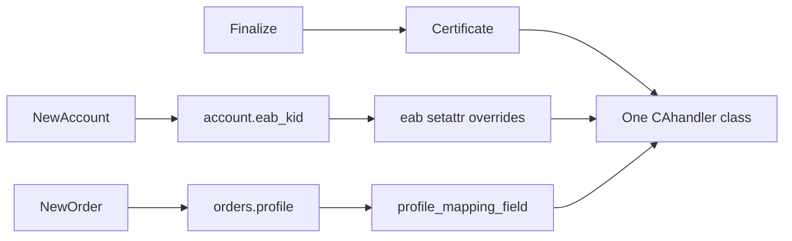
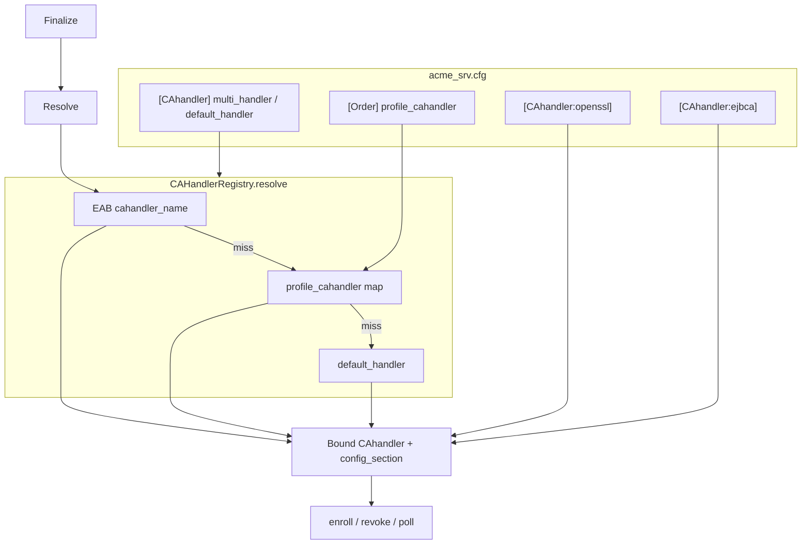

<!-- markdownlint-disable MD013 MD029 -->

<!-- wiki-title Multi CA handler design -->

# Multi CA handler design

Design proposal for running **multiple CA handlers in one acme2certifier instance**, selected per ACME profile and/or EAB kid / eab-profiling. Based on [](package-layout.md).

**Decisions locked for this proposal:**

| Topic | Choice |
| --- | --- |
| Selection precedence | EAB kid / eab-profiling **wins** over ACME profile (aligned with `eab_profile_header_info_check`) |
| Config shape | Named INI sections: `[CAhandler]` registry + `[CAhandler:<name>]` per handler |

Related:

- [Package layout migration](package-layout.md)
- [EAB profiling](../eab_profiling.md)
- [ACME profiles](../acme_profiling.md)
- [CA handler authoring](../ca_handler.md)
- Phase 10 handler fallback removal: [phase10-handler-fallback-removal.md](phase10-handler-fallback-removal.md)

## Goals

1. One process can enroll/revoke/poll via different `CAhandler` implementations (e.g. openssl + ejbca + vault).
2. Handler selection by:
   - ACME `profile` on the order, and/or
   - EAB kid profile (`cahandler_name` in the kid keyfile entry).
3. Every usable handler is configured in `acme_srv.cfg` as `[CAhandler:<name>]` (module + handler-specific options). EAB kid profiles may still override attributes on the **selected** handler instance (existing eab-profiling).
4. **Fully backwards compatible:** if multi-handler is disabled (default), classical `[CAhandler]` with `handler_module` / deprecated `handler_file` behaves as today.

## Non-goals

- Selecting different EAB, DB, or Hooks plugins per profile/kid (out of scope).
- Changing the public ACME wire format beyond existing `profile` / EAB.
- Replacing existing eab-profiling attribute overrides (`cahandler: { profile_id, api_user, ... }`).
- Implementing Phase 10 (`handler_file` removal) in this feature.

## Current architecture (baseline)

| Area | Location |
| --- | --- |
| ACME core | `acme2certifier/acme_srv/` |
| CA plugins | `acme2certifier/cahandlers/` |
| Loader | `acme2certifier/acme_srv/helpers/plugin_loader.py` → `ca_handler_load()` |
| Config | `acme2certifier/acme_srv/helpers/config.py` → `load_config()` |
| EAB profile apply | `acme2certifier/acme_srv/helpers/eab.py` |
| Enroll / revoke / poll | `acme2certifier/acme_srv/certificate.py` |
| Directory `handler_check` / `profiles_sync` | `acme2certifier/acme_srv/directory.py` |

Today exactly **one** CA handler class is loaded per process from `[CAhandler]`. Call sites store the class and instantiate as a context manager:

```python
with self.cahandler(self.debug, self.logger) as ca_handler:
    ca_handler.enroll(csr)
```

Handlers almost universally load options from the hard-coded section name `"CAhandler"` in `_config_load()`. Dogtag/FreeIPA already use a class attribute `CONFIG_SECTION = "CAhandler"` — that pattern is generalized here.

EAB profiling and ACME profiles today change **parameters** on that single handler (template / `profile_id` / credentials), not which module is loaded.



## Proposed architecture



### Components

| Component | Path (new/changed) | Role |
| --- | --- | --- |
| Registry | **new** `acme2certifier/acme_srv/helpers/cahandler_registry.py` | Parse multi-handler config, load named modules, resolve handler |
| Loader | `helpers/plugin_loader.py` | Keep `ca_handler_load()` for classical mode; add section-aware load helper used by registry |
| Section binding | handlers + small helper | Each instance knows `config_section` (`CAhandler` or `CAhandler:<name>`) |
| Certificate | `certificate.py` | Resolve handler per enroll/revoke/poll instead of one process-global class |
| Order | `order.py` | Load `profile_cahandler`; optionally persist selected handler name |
| Directory / Trigger / Renewalinfo | respective modules | Use registry (default or all named handlers) |
| EAB keyfile | kid profile JSON/YAML | New kid-level `cahandler_name` |
| Docs / tests | `docs/`, `test/` | Feature docs + unit/integration coverage |

## Configuration

### Classical mode (default — unchanged)

```ini
[CAhandler]
handler_module: acme2certifier.cahandlers.openssl_ca_handler
# ... openssl-specific keys ...
```

`multi_handler` absent or `False` → existing `ca_handler_load()` path only. No named sections required.

### Multi-handler mode

```ini
[CAhandler]
multi_handler: True
default_handler: openssl
# Shared / cross-cutting keys may remain here, e.g.:
# ca_error_details_forward: False
# enrollment_config_log: False

[CAhandler:openssl]
handler_module: acme2certifier.cahandlers.openssl_ca_handler
issuing_ca_key: /path/to/key.pem
issuing_ca_key_passphrase: secret
cert_validity_days: 365

[CAhandler:ejbca]
handler_module: acme2certifier.cahandlers.ejbca_ca_handler
api_host: https://ejbca.example
cert_profile_name: ENDUSER
# handler_file still allowed here until Phase 10 (same deprecation rules)

[Order]
profiles: {"short": "https://example/p/short", "long": "https://example/p/long"}
profile_cahandler: {"short": "openssl", "long": "ejbca"}
```

Rules:

1. `multi_handler: True` requires `default_handler` naming a defined `[CAhandler:<name>]` section.
2. Each `[CAhandler:<name>]` must set `handler_module` (or deprecated `handler_file`) exactly as classical `[CAhandler]` does today.
3. Handler-specific options live in the named section, **not** in the registry section (except intentionally shared keys documented below).
4. Unknown `profile_cahandler` / `cahandler_name` targets → hard error at resolve time (enrollment fails with `serverInternal` / clear log); startup should validate that all mapped names exist.
5. Classical keys `handler_module` / `handler_file` on `[CAhandler]` when `multi_handler: True` are ignored with a warning (named sections only).

### Shared keys on `[CAhandler]` in multi mode

Keep process-wide flags on the registry section (not duplicated per handler), matching today’s readers in Directory / Certificate helpers:

- `ca_error_details_forward`
- `enrollment_config_log` / `enrollment_config_log_skip_list`
- `profiles_sync` / `profiles_sync_interval` / `acme_url` (see Directory behavior below)
- deprecated `eab_profiling` / `allowed_domainlist` shims if still present

Per-handler copies of the same key in `[CAhandler:<name>]` override the shared value when that handler loads its section (merge semantics: named section first, then optional fallback to `[CAhandler]` for missing keys).

### EAB kid profile extension

Kid-level key (sibling of existing `cahandler` object — **not** inside it, so setattr profiling does not treat it as a handler attribute):

```json
{
  "keyid_00": {
    "hmac": "...",
    "cahandler_name": "ejbca",
    "cahandler": {
      "cert_profile_name": "ENDUSER",
      "allowed_domainlist": ["*.example.com"]
    }
  },
  "keyid_01": {
    "hmac": "...",
    "cahandler": {
      "profile_id": "profile_1"
    }
  }
}
```

- `cahandler_name` selects the registry entry.
- Existing `cahandler` object continues to override attributes on the **already selected** instance via `eab_profile_check()`.
- If `cahandler_name` is omitted, selection falls through to ACME profile mapping, then `default_handler`.

YAML equivalent: top-level `cahandler_name` under the kid.


## YAML configuration

Multi-handler works identically for `acme_srv.cfg` and `acme_srv.yaml`. Top-level YAML keys map to ConfigParser sections; `CAhandler:openssl:` produces section `CAhandler:openssl`.

See [`docs/multi_cahandler.md`](../multi_cahandler.md) for operator examples.

## Selection algorithm

Implemented in `CAHandlerRegistry.resolve(...)`.

Inputs available at enroll time (from CSR → certificate → order/account joins, same as today):

- `account.eab_kid`
- `orders.profile`
- optional persisted `orders.cahandler` (see persistence)

```text
if not multi_handler:
    return classical_single_handler

# 1) EAB wins
if eab_profiling enabled and eab_kid present:
    name = kid_profile.cahandler_name  # if set
    if name:
        return registry[name]  # error if missing

# 2) ACME profile
if order.profile and profile in profile_cahandler:
    return registry[profile_cahandler[profile]]

# 3) Domain routing (allowed_domainlist on named sections)
# 4) default_handler
return registry[default_handler]
```

This mirrors the existing priority in `eab_profile_header_info_check()` (EAB → ACME profile → header info → none).

Revoke / poll / trigger paths that operate on an existing certificate **prefer the handler name stored at enrollment** (see below). If absent (upgrade / classical certs), re-run the same resolve algorithm from current eab_kid + order.profile.

## Config section binding (handler load)

Problem: handlers call `load_config(..., "CAhandler")` and read options from section `"CAhandler"`.

Solution (minimal, consistent with Dogtag/FreeIPA `CONFIG_SECTION`):

1. Add helper, e.g. `cahandler_config_section(handler) -> str`, default `"CAhandler"`.
2. Registry constructs a **bound factory**:

   ```python
   class BoundCAHandler:
       def __init__(self, handler_cls: type, section: str) -> None: ...
       def __call__(self, debug: bool, logger: logging.Logger) -> Any:
           inst = self.handler_cls(debug, logger)
           inst.config_section = self.section  # e.g. "CAhandler:ejbca"
           return inst
   ```

3. Each built-in handler’s `_config_load()` uses:

   ```python
   section = getattr(self, "config_section", getattr(self, "CONFIG_SECTION", "CAhandler"))
   config_dic = load_config(self.logger, section)
   # read options from `section`, with optional fallback to [CAhandler] for shared keys
   ```

4. Skeleton + docs updated so out-of-tree handlers follow the same pattern. Until a custom handler is updated, multi-handler mode against that handler is unsupported (document clearly); classical mode unchanged.

Optional helper to reduce boilerplate:

```python
def cahandler_section_get(config_dic, section: str) -> Mapping[str, str]:
    """Return merged view: named section overrides, then [CAhandler] fallbacks."""
```

## Persistence

Add nullable column / field:

- WSGI + Django: `orders.cahandler` (varchar, e.g. 64) — name of registry entry used for the order’s certificate lifecycle.

Set once when the finalize path resolves the handler (before enroll). Revoke/poll read it first.

No migration pain for classical mode: column stays `NULL`; resolve falls back to algorithm / single handler.

Certificate operation logs (`CertificateLogger`) should include `cahandler` name alongside existing `eab_kid` / `profile` when multi-handler is enabled.

## Call-site changes

### `certificate.py` (primary)

Replace process-global `self.cahandler = module.CAhandler` usage for enroll/revoke/poll with:

```python
bound = self.cahandler_registry.resolve_for_certificate(certificate_name_or_csr)
with bound(self.debug, self.logger) as ca_handler:
    ca_handler.enroll(csr)
```

Classical mode: registry wraps the single loaded class with `config_section="CAhandler"` so call sites are unified.

ASA special-case (`cn2san_add` when module ends with `asa_ca_handler`) must key off the **resolved** module, not only startup config.

### `directory.py`

- `handler_check`: when multi-handler enabled, run check on **all** registered handlers (or at least `default_handler` + every name referenced by `profile_cahandler` / fail-fast list). First failure fails directory response (same severity as today).
- `profiles_sync`: keep driven by shared `[CAhandler]` flags; invoke `synchronize_profiles` only on handlers that implement it (union of returned profiles into Directory `meta.profiles`, name-prefixed or merged — **merge by profile key**, last writer wins, log conflicts). Document that operators should avoid overlapping profile names across handlers when syncing.

### `order.py`

- Load `profile_cahandler` JSON next to `profiles`.
- On finalize (or when creating order if selection is already determined), resolve and store `orders.cahandler`.
- `profile_mapping_field` loading must use the handler that will enroll (or skip until finalize once resolved).

### `trigger.py` / `renewalinfo.py`

- Resolve via stored order/certificate handler name when available; else `default_handler`.

### EAB helpers

- `kid_profile_handler` (and SQL variant): expose `cahandler_name_get(csr|kid)` without consuming the `cahandler` attribute dict.
- Ensure `cahandler_name` is **not** passed into `eab_profile_string_check` setattr loop.

## Backwards compatibility matrix

| Setup | Behavior |
| --- | --- |
| `[CAhandler]` + `handler_module` only | Unchanged classical single handler |
| `handler_file` / default `acme_srv.ca_handler` | Unchanged until Phase 10 |
| EAB profiling without `cahandler_name` | Unchanged attribute overrides on the single/default handler |
| ACME `profiles` without `profile_cahandler` | Unchanged; profile still maps to handler `profile_mapping_field` |
| `multi_handler: True` | New path; classical `handler_module` on `[CAhandler]` ignored |
| Upgrade DB without `orders.cahandler` | Column added; NULL → re-resolve |

## Error handling

| Condition | Behavior |
| --- | --- |
| `multi_handler` without `default_handler` | Startup critical log; refuse to serve (directory error) |
| Named section missing `handler_module`/`handler_file` | Startup critical for that name |
| Mapped name not in registry | Enroll/revoke fails; log critical |
| EAB `cahandler_name` unknown | Enroll fails (do not silently fall back — EAB is authoritative when set) |
| Handler `_config_load` ignores `config_section` | Misconfiguration / unsupported custom handler; enroll uses empty/wrong options — document + `handler_check` should catch missing required opts |

## Testing (pytest)

| Area | Cases |
| --- | --- |
| Registry parse | classical; multi with two sections; missing default; bad map target |
| Resolve order | EAB name wins over profile map; profile map wins over default; default alone |
| Section binding | Bound factory sets `config_section`; load reads named section options |
| Certificate | enroll uses openssl vs ejbca mocks by kid/profile; revoke uses stored name |
| EAB | `cahandler_name` not setattr’d; still applies `cahandler` overrides on selected instance |
| Backcompat | existing tests pass with `multi_handler` unset |
| Directory | multi `handler_check` aggregates failures |

Prefer fakes/mocks of `CAhandler` rather than live CA backends.

## Documentation deliverables (implementation PR)

- New operator doc `docs/multi_cahandler.md` (config examples, selection rules, migration from single handler).
- Cross-links from `eab_profiling.md`, `acme_profiling.md`, `ca_handler.md`, `acme_srv.md`.
- Skeleton handler: use `config_section` / `CONFIG_SECTION`.
- `CHANGES.md` entry when implementing.

## Implementation phases

### Phase A — Foundation (no behavior change for classical)

1. Add `cahandler_registry.py` + config parsing (`multi_handler`, `default_handler`, named sections, `profile_cahandler`).
2. Extend `ca_handler_load` / add `ca_handler_load_from_section(logger, config_dic, section)`.
3. Introduce `BoundCAHandler` + `config_section` convention; migrate built-in handlers’ `_config_load` to honor it (behavior identical when section is `CAhandler`).
4. Wire Certificate/Directory/Order/Trigger/Renewalinfo through registry **in classical mode** (single bound handler) so call sites are unified.
5. Tests for registry classical path + section helper.

### Phase B — Selection + persistence

1. DB: `orders.cahandler` (WSGI schema + Django model/migration).
2. Resolve algorithm (EAB → profile → default); persist on finalize.
3. EAB `cahandler_name` support in kid_profile / sql handlers + docs.
4. Certificate enroll/revoke/poll use resolve / stored name.
5. Tests for precedence and revoke stickiness.

### Phase C — Directory / ops polish

1. Multi `handler_check` and `profiles_sync` merge policy.
2. Operator doc + example `acme_srv.cfg` snippet + sample kid profile.
3. Logging / cert operations log fields.

Phases A→B→C can ship as one PR or stacked PRs; **Phase A alone must not change classical runtime behavior**.

## File touch list (implementation)

| File | Change |
| --- | --- |
| `acme2certifier/acme_srv/helpers/cahandler_registry.py` | **new** |
| `acme2certifier/acme_srv/helpers/plugin_loader.py` | section-aware load |
| `acme2certifier/acme_srv/helpers/config.py` | parse helpers / merge section view |
| `acme2certifier/acme_srv/helpers/eab.py` | ignore/`get` `cahandler_name` at kid level |
| `acme2certifier/acme_srv/certificate.py` | resolve via registry |
| `acme2certifier/acme_srv/order.py` | `profile_cahandler`, persist name |
| `acme2certifier/acme_srv/directory.py` | multi check / sync |
| `acme2certifier/acme_srv/trigger.py`, `renewalinfo.py` | resolve |
| `acme2certifier/cahandlers/*_ca_handler.py` | `config_section` in `_config_load` |
| `acme2certifier/eabhandlers/kid_profile_handler.py` (+ sql) | `cahandler_name` |
| `acme2certifier/dbhandlers/*`, Django models | `orders.cahandler` |
| `test/test_cahandler_registry.py` etc. | **new** |
| `docs/multi_cahandler.md` | **new** (at implement time) |

## Open follow-ups (non-blocking)

- Whether `profiles_sync` should be per-handler flags inside named sections (can wait until an operator needs it).
- Whether Directory should advertise only profiles that map to healthy handlers.
- Metrics/audit export of handler name per enrollment (ops log may suffice initially).
