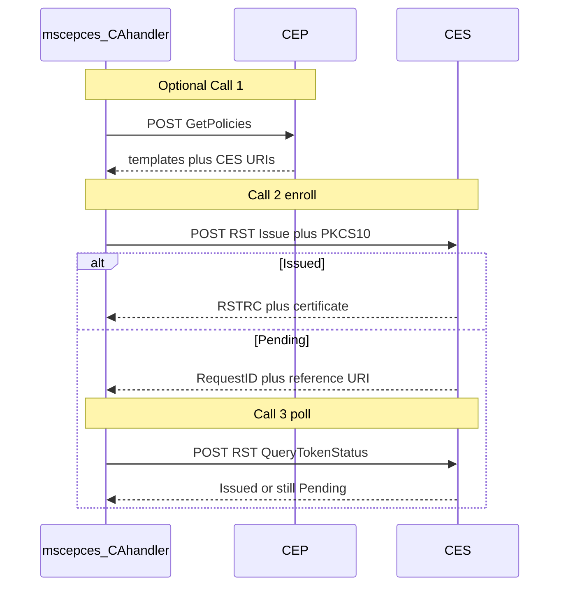

# CA Handler for Microsoft CEP/CES (MS-XCEP / MS-WSTEP)

This CA handler enrolls certificates through Active Directory Certificate Services **Certificate Enrollment Policy Web Service (CEP)** and **Certificate Enrollment Web Service (CES)** using SOAP over HTTPS:

- [MS-XCEP](https://learn.microsoft.com/en-us/openspecs/windows_protocols/ms-xcep/08ec4475-407d-4388-9bea-3f7a027e2f10) — optional policy / template discovery (`GetPolicies`)
- [MS-WSTEP](https://learn.microsoft.com/en-us/openspecs/windows_protocols/ms-wstep/4766a85d-0d18-4fa1-a51f-e5cb98b752ea) — certificate enrollment and pending poll (`RequestSecurityToken`)

Unlike [MS-ICPR](msicpr.md), this handler does **not** use Impacket or Certipy. Unlike [mscertsrv](mscertsrv.md), it does **not** use classic ASP Web Enrollment (`/certsrv/`).

## Limitations

- Revocation is not supported (CEP/CES expose no revoke operation).
- Client-certificate CES authentication is not supported in v1.
- Key-based renewal is not supported in v1.
- HTTPS only.

## Preparation (Windows)

CEP/CES are separate AD CS role services from classic Web Enrollment.

1. Enterprise CA online; IIS with a server SSL certificate (thumbprint for binding).
2. Install and configure (auth type must match on CEP and CES):

```powershell
Import-Module ServerManager
Add-WindowsFeature Adcs-Enroll-Web-Pol, Adcs-Enroll-Web-Svc

$thumb = "<SSL-cert-thumbprint>"
Install-AdcsEnrollmentPolicyWebService -AuthenticationType Kerberos -SSLCertThumbprint $thumb -Force
Install-AdcsEnrollmentWebService `
  -CAConfig "ca.contoso.com\Contoso-CA" `
  -AuthenticationType Kerberos `
  -SSLCertThumbprint $thumb `
  -ApplicationPoolIdentity `
  -Force
```

For username/password use `-AuthenticationType Username` on both. Prefer a dedicated service account in production environments.

1. If CES is **not** co-located with the CA and auth is Kerberos or client-cert: configure **constrained delegation** to the CA (`HOST` + `RPCSS`). See [Microsoft CES overview — Delegation](https://learn.microsoft.com/en-us/windows-server/identity/ad-cs/certificate-enrollment-web-service#delegation-requirements).
2. Obtain the CEP/CES HTTPS URLs (use these as `cep_url` / `ces_url` in `acme_srv.cfg`).

Virtual app names depend on auth type and CA common name:

| Service                | Path pattern                                             |
| ---------------------- | -------------------------------------------------------- |
| CEP (Kerberos)         | `/ADPolicyProvider_CEP_Kerberos/service.svc/CEP`         |
| CES (Kerberos)         | `/<CACommonName>_CES_Kerberos/service.svc/CES`           |
| CEP (UsernamePassword) | `/ADPolicyProvider_CEP_UsernamePassword/service.svc/CEP` |
| CES (UsernamePassword) | `/<CACommonName>_CES_UsernamePassword/service.svc/CES`   |

Full URL: `https://<iis-fqdn>` + path (example: `https://ca.contoso.com/ADPolicyProvider_CEP_Kerberos/service.svc/CEP`).

**PowerShell snipped to list the URLs on the CA/IIS host**:

```powershell
Import-Module WebAdministration
$hostFqdn = [System.Net.Dns]::GetHostEntry($env:COMPUTERNAME).HostName
Get-WebApplication -Site 'Default Web Site' |
  Where-Object { $_.Path -match 'CEP_|CES_' } |
  ForEach-Object {
    $svc = if ($_.Path -match 'CEP_') { 'CEP' } else { 'CES' }
    [pscustomobject]@{
      App = $_.Path
      Url = "https://$hostFqdn$($_.Path)/service.svc/$svc"
    }
  }
```

**Or in IIS Manager:** Sites → Default Web Site → each `*_CEP_`* / `*_CES_`* app → Application Settings → **URI** (CEP; record for Group Policy / clients). Append `/CEP` or `/CES` if the stored URI ends at `service.svc`.

**Smoke-test CEP** (on a domain-joined client with a ticket, or with explicit credentials):

```powershell
certutil -ping -kerberos -config "https://<iis-fqdn>/ADPolicyProvider_CEP_Kerberos/service.svc/CEP" CEP
```

1. Ensure the enrollment account has **Enroll** permission on the target template.
2. **Kerberos only — align Extended Protection (EPA)** between IIS and WCF (see [Troubleshooting](#kerberos-epa--channel-bindings-requests-gssapi-version) below). Fresh installs often leave IIS EPA at **Off** (`Never`) while the CEP/CES WCF binding expects **Always**, which yields HTTP 500 `ServiceActivationException`. Packaged Docker/deb (and many RPM deps) ship `requests-gssapi` < 1.4.0 without channel-binding-supprot — configure both sites to **Never**, or install ≥ 1.4.0 for **Required** + **Always**.

## Configuration

```ini
[Order]
allowed_header_values: ["WebServer", "WebServerModified"]

[CAhandler]
handler_module: acme2certifier.cahandlers.mscepces_ca_handler
ces_url: https://ces.example.com/ENTCA_CES_Kerberos/service.svc/CES
# optional: CEP for template check / CES discovery
cep_url: https://cep.example.com/ADPolicyProvider_CEP_Kerberos/service.svc/CEP
template: WebServer
auth_method: gssapi
ces_username: enrollment@EXAMPLE.COM
ces_password: secret
ca_bundle: /path/to/ca-bundle.pem
# optional: append extra CA PEMs (CEP GetPolicies already supplies the issuing CA)
# ca_certificates: /path/to/ca-chain.pem
verify: True
gssapi_channel_bindings: auto
# optional Kerberos keytab
# krb5_principal: host/a2c.example.com@EXAMPLE.COM
# krb5_keytab: /etc/krb5.keytab
# krb5_config: /etc/krb5.conf
```

### Authentication

| `auth_method`       | Mechanism                                                                  |
| ------------------- | -------------------------------------------------------------------------- |
| `gssapi`            | SPNEGO via `requests_gssapi`                                               |
| `username_password` | WS-Security `UsernameToken` in the SOAP header (UsernamePassword IIS apps) |

NTLM is not supported for [security reasons](https://techcommunity.microsoft.com/blog/windows-itpro-blog/advancing-windows-security-disabling-ntlm-by-default/4489526).

For `auth_method: gssapi` with `ces_username` / `ces_password`, the handler acquires a TGT via password `kinit` (with `krb5_config` / temporary ccache), then loads GSSAPI credentials for SPNEGO. `ces_username` **must be a Kerberos principal in** `user@REALM` **form** (for example `enrollment@EXAMPLE.COM`). Do not use NetBIOS `DOMAIN\\user`.

### Template selection

The ACME CSR cannot be re-signed by a2c, so the certificate template is sent as WSTEP `AdditionalContext` / `CertificateTemplate` (same role as CertAttrib in mscertsrv). Wenn clients optionally select templete values by using the [profiling feature](https://github.com/grindsa/acme2certifier/blob/master/docs/acme_profiling.md).

Optional `ca_templates_check: warn|on|off` validates the template against CEP `GetPolicies` when `cep_url` is set.

## Troubleshooting

### Kerberos EPA / channel bindings (`requests-gssapi` version)

CEP/CES Kerberos needs **aligned** Extended Protection between IIS and WCF. Client CBT (channel bindings) is only available with `requests-gssapi` [≥ 1.4.0](https://github.com/pythongssapi/requests-gssapi/releases/tag/v1.4.0).

With `requests-gssapi` **1.2.x**, CBT is unavailable. With `gssapi_channel_bindings: auto`, the handler logs `requests-gssapi does not support channel_bindings; continuing without` and proceeds without CBT. That is incompatible with IIS EPA **Required** / WCF **Always** (Negotiate may succeed, then HTTP **401**, or activation fails — see below).

| Deployment | Typical `requests-gssapi`                                                                                                                                                                                                                                                                                                         | IIS + WCF for Kerberos                                                                          |
| ---------- | --------------------------------------------------------------------------------------------------------------------------------------------------------------------------------------------------------------------------------------------------------------------------------------------------------------------------------- | ----------------------------------------------------------------------------------------------- |
| pip        | ≥ 1.4.0 from PyPI                                                                                                                                                                                                                                                                                                                 | Prefer **Required** + **Always** (production)                                                   |
| Docker     | ≥ 1.4.0 from a2c **0.46.2**; **1.2.x** before                                                                                                                                                                                                                                                                                     | Prefer **Required** + **Always** when ≥ a2c 0.46.2; else **Never**                              |
| RPM        | stock AppStream **1.2.x**; 1.4.0 packages for [EL8](https://github.com/grindsa/sbom/blob/main/rpm-repo/RPMs/rhel8/python39/python39-requests-gssapi-1.4.0-1grindsa.el8.noarch.rpm) / [EL9](https://github.com/grindsa/sbom/blob/main/rpm-repo/RPMs/rhel9/python3/python3-requests-gssapi-1.4.0-1grindsa.el9.noarch.rpm) **1.4.0** | Prefer **Required** + **Always** when ≥ 1.4.0; else lab: both **Never**, or install grindsa RPM |
| `.deb`     | stock AppStream **1.2.x** ; 1.4.0 packages for [Ubuntu 24.04](https://github.com/grindsa/sbom/blob/main/deb-repo/DEBs/ub24.04/python3-requests-gssapi_1.4.0-1grindsa_all.deb) / [Ubuntu 26.04](https://github.com/grindsa/sbom/blob/main/deb-repo/DEBs/ub26.04/python3-requests-gssapi_1.4.0-1grindsa_all.deb) **1.4.0**          | Prefer **Required** + **Always** when ≥ 1.4.0; else both **Never**, or install grindsa `.deb`   |

`gssapi_channel_bindings: off` does **not** change wire behavior when CBT is unsupported (`auto` already skips CBT).

### HTTP 500 `ServiceActivationException` on Kerberos CEP/CES

Symptom: Negotiate challenge (401) succeeds, then the authenticated POST returns HTTP 500 with an empty body. Windows Application log (`System.ServiceModel`) shows:

> ExtendedProtectionPolicy.PolicyEnforcement values do not match. IIS has a value of **Never** while the WCF Transport has a value of **Always**.

UsernamePassword CEP/CES apps are unaffected. This is a **server** IIS/WCF mismatch, not an a2c SOAP or credential error.

**Option A — when CBT:** set IIS Extended Protection to **Required** on the Kerberos virtual apps and keep WCF `policyEnforcement="Always"`, then recycle the app pools. Client: `gssapi_channel_bindings: auto` (or `on`) with `requests-gssapi` ≥ 1.4.0.

```powershell
$appcmd = "$env:windir\system32\inetsrv\appcmd.exe"
& $appcmd unlock config /section:system.webServer/security/authentication/windowsAuthentication

foreach ($app in @(
  'Default Web Site/ADPolicyProvider_CEP_Kerberos',
  'Default Web Site/<CACommonName>_CES_Kerberos'
)) {
  & $appcmd set config $app `
    /section:system.webServer/security/authentication/windowsAuthentication `
    /extendedProtection.tokenChecking:Require `
    /commit:apphost
}

Restart-WebAppPool WSEnrollmentPolicyServer
Restart-WebAppPool WSEnrollmentServer
```

**Option B — packaged a2c without CBT:** set **both** sides to **Never** (weaker; not for production).

1. IIS (GUI or `appcmd`): Extended Protection **Off** (`tokenChecking:None`) on the same Kerberos apps; leave kernel-mode authentication enabled.
2. WCF: edit both `web.config` files (IIS GUI does **not** change these):

```text
%windir%\SystemData\CEP\ADPolicyProvider_CEP_Kerberos\web.config
%windir%\SystemData\CES\<CACommonName>_CES_Kerberos\web.config
```

Set (or change) under `<transport clientCredentialType="Windows">`:

```xml
<extendedProtectionPolicy policyEnforcement="Never" />
```

1. Recycle `WSEnrollmentPolicyServer` and `WSEnrollmentServer` in IIS Manager.

See also [IIS Extended Protection](https://learn.microsoft.com/en-us/iis/configuration/system.webserver/security/authentication/windowsauthentication/extendedprotection/) and [KB5005413](https://support.microsoft.com/en-us/topic/kb5005413-mitigating-ntlm-relay-attacks-on-active-directory-certificate-services-ad-cs-3612b773-4043-4aa9-b23d-b87910cd3429) (CES `web.config` EPA).

## Call flow (a2c ↔ CEP/CES) - Development documenation - no need to read

Communication is **SOAP over HTTPS**, not REST. Every call is `POST` with `Content-Type: application/soap+xml; charset=utf-8`.

### Shared HTTP layer

| Field                   | Value                                               |
| ----------------------- | --------------------------------------------------- |
| Method                  | `POST`                                              |
| Request headers         | `Content-Type: application/soap+xml; charset=utf-8` |
| Success                 | `200 OK` + SOAP body (or `500` with SOAP `Fault`)   |
| Auth (Kerberos)         | Transport: `Authorization: Negotiate …`             |
| Auth (UsernamePassword) | SOAP header `wsse:Security` / `wsse:UsernameToken`  |

**Namespaces:**

| Prefix   | URI                                                                                  |
| -------- | ------------------------------------------------------------------------------------ |
| `s`      | `http://www.w3.org/2003/05/soap-envelope`                                            |
| `a`      | `http://www.w3.org/2005/08/addressing`                                               |
| `wst`    | `http://docs.oasis-open.org/ws-sx/ws-trust/200512`                                   |
| `wsse`   | `http://docs.oasis-open.org/wss/2004/01/oasis-200401-wss-wssecurity-secext-1.0.xsd`  |
| `wsu`    | `http://docs.oasis-open.org/wss/2004/01/oasis-200401-wss-wssecurity-utility-1.0.xsd` |
| `xcep`   | `http://schemas.microsoft.com/windows/pki/2009/01/enrollmentpolicy`                  |
| `enroll` | `http://schemas.microsoft.com/windows/pki/2009/01/enrollment`                        |
| `auth`   | `http://schemas.xmlsoap.org/ws/2006/12/authorization`                                |

**Envelope skeleton:**

```xml
<s:Envelope xmlns:s="http://www.w3.org/2003/05/soap-envelope"
            xmlns:a="http://www.w3.org/2005/08/addressing">
  <s:Header>
    <a:Action s:mustUnderstand="1">{operation Action URI}</a:Action>
    <a:MessageID>urn:uuid:{uuid}</a:MessageID>
    <a:To s:mustUnderstand="1">{POST URL}</a:To>
  </s:Header>
  <s:Body>{operation payload}</s:Body>
</s:Envelope>
```

### Call 1 — CEP `GetPolicies` (optional)

| Item   | Detail                                                                                  |
| ------ | --------------------------------------------------------------------------------------- |
| URL    | `cep_url`                                                                               |
| Action | `http://schemas.microsoft.com/windows/pki/2009/01/enrollmentpolicy/IPolicy/GetPolicies` |

```xml
<GetPolicies xmlns="http://schemas.microsoft.com/windows/pki/2009/01/enrollmentpolicy">
  <client>
    <lastUpdate xmlns:xsi="http://www.w3.org/2001/XMLSchema-instance" xsi:nil="true"/>
    <preferredLanguage xsi:nil="true"/>
  </client>
  <requestFilter>
    <policyOIDs xsi:nil="true"/>
    <clientVersion>0</clientVersion>
    <serverVersion>0</serverVersion>
  </requestFilter>
</GetPolicies>
```

Parse: template `commonName`, CES URIs under `cAs/cA/uris/cAURI/uri`. Example: [MS-XCEP GetPoliciesResponse](https://learn.microsoft.com/en-us/openspecs/windows_protocols/ms-xcep/fd102740-c9e7-40f4-a8d9-0bd988e527ba).

### Call 2 — CES Issue (required on enroll)

| Item   | Detail                                                                  |
| ------ | ----------------------------------------------------------------------- |
| URL    | `ces_url`                                                               |
| Action | `http://schemas.microsoft.com/windows/pki/2009/01/enrollment/RST/wstep` |

```xml
<wst:RequestSecurityToken xmlns:wst="http://docs.oasis-open.org/ws-sx/ws-trust/200512"
                          xmlns:wsse="http://docs.oasis-open.org/wss/2004/01/oasis-200401-wss-wssecurity-secext-1.0.xsd"
                          xmlns:auth="http://schemas.xmlsoap.org/ws/2006/12/authorization">
  <wst:TokenType>http://docs.oasis-open.org/wss/2004/01/oasis-200401-wss-x509-token-profile-1.0#X509v3</wst:TokenType>
  <wst:RequestType>http://docs.oasis-open.org/ws-sx/ws-trust/200512/Issue</wst:RequestType>
  <wsse:BinarySecurityToken
      ValueType="http://schemas.microsoft.com/windows/pki/2009/01/enrollment#PKCS10"
      EncodingType="http://docs.oasis-open.org/wss/2004/01/oasis-200401-wss-wssecurity-secext-1.0.xsd#base64binary">
    {base64_pkcs10_der}
  </wsse:BinarySecurityToken>
  <auth:AdditionalContext>
    <auth:ContextItem Name="CertificateTemplate">
      <auth:Value>WebServer</auth:Value>
    </auth:ContextItem>
  </auth:AdditionalContext>
</wst:RequestSecurityToken>
```

Response: `enroll:DispositionMessage` (`Issued` / `Pending` / `Denied`), `enroll:RequestID`, issued `BinarySecurityToken`, or pending `Reference URI`.

| CES outcome    | ACME return                                                                                                                        |
| -------------- | ---------------------------------------------------------------------------------------------------------------------------------- |
| Issued         | `(None, cert_bundle, cert_raw, None)` — leaf from WSTEP; CA chain appended from CEP `cA/certificate` and/or `ca_certificates` file |
| Pending        | `(None, None, None, "{request_id}@@{ces_reference}")`                                                                              |
| Denied / Fault | `(error, None, None, None)`                                                                                                        |

CES typically returns only the end-entity cert (`#X509v3`). With `cep_url` set, a2c pulls the issuing CA from CEP `GetPolicies` (`cAs/cA/certificate`) and appends it to `cert_bundle`. Use optional `ca_certificates` (PEM file) for extra intermediates or when CEP is unavailable.

### Call 3 — CES `QueryTokenStatus` (poll)

| Item        | Detail                                                                         |
| ----------- | ------------------------------------------------------------------------------ |
| URL         | CES reference from pending response (or `ces_url`)                             |
| Action      | same RST action                                                                |
| RequestType | `http://schemas.microsoft.com/windows/pki/2009/01/enrollment/QueryTokenStatus` |

```xml
<wst:RequestSecurityToken xmlns:wst="http://docs.oasis-open.org/ws-sx/ws-trust/200512"
                          xmlns:enroll="http://schemas.microsoft.com/windows/pki/2009/01/enrollment">
  <wst:RequestType>http://schemas.microsoft.com/windows/pki/2009/01/enrollment/QueryTokenStatus</wst:RequestType>
  <enroll:RequestID>{request_id}</enroll:RequestID>
</wst:RequestSecurityToken>
```


