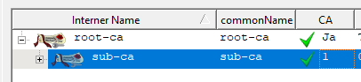

<!-- markdownlint-disable  MD013 -->
<!-- wiki-title CA handler for XCA -->
# Support for an XCA based Certificate Authorities

This handler can be used to store, certificates and requests in an [XCA](https://github.com/chris2511/xca/) SQLite database.

It is also possible to fetch enrollment templates from XCA an apply them to certificate signing requests.

## Prerequisites

You need to have a ready-made xca database with CA certificate and keys imported. You further need the `Internal Name` from the Certificate Authorities to be used as show in the XCA application.



## Configuration

- copy the ca_handler into the acme directory

```bash
root@rlh:~# cp example/ca_handlers/xca_ca_handler.py acme_srv/ca_handler.py
```

- place the XCA database into a directory which is accessible by acme2certifier.

- modify the server configuration (/acme_srv/acme_srv.cfg) and add the following parameters

```config
[CAhandler]
xdb_file: acme_srv/xca/acme2certifier.xdb
issuing_ca_name: sub-ca
issuing_ca_key: sub-ca-key
passphrase_variable: XCA_PASSPHRASE
ca_cert_chain_list: ["root-ca"]
template_name: XCA template to be applied to CSRs
```

- `xdb_file` - path to XCA database
- `issuing_ca_name` - XCA name of the certificate authority used to issue certificates.
- `issuing_ca_key` - XCA name of the ley used to sign certificates. If not set same value as configured in `issuing_ca_name` will be assumed.
- `passphrase_variable` - *optional* - name of the environment variable containing the passphrase to decrypt the CA key (a configured `passphrase` parameter takes precedence)
- `passphrase` - *optional* - passphrase to access the database and decrypt the private CA Key
- `ca_cert_chain_list` - *optional* - List of root and intermediate CA certificates to be added to the bundle return to an ACME-client (the issuing CA cert must not be included)
- `template_name` - *optional* - name of the XCA template to be applied during certificate issuance

Template support has been introduced starting from v0.13. Support is limited to the below parameters which can be applied during certificate issuance:

- Certificate validity (`validN`/`validM`)
- basicConstraints (`ca`)
- KeyUsage attributes (`keyUse`) - if not included attribute will be defaulted to `digitalSignature, nonRepudiation, keyEncipherment, keyAgreement`
- extendedKeyUsage attributes (`eKeyUse`)
- crlDistributionPoints (`crlDist`)
- Enforcement of the following DN attributes:
  - OU: OrganizationalUnit
  - O: Organization
  - L: Locality
  - S: StateOrProvinceName
  - C: CountryName

Enjoy enrolling and revoking certificates...
