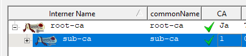

<!-- markdownlint-disable MD013 -->

<!-- wiki-title: CA Handler for XCA -->
<!-- wiki-category: CA Handlers -->

# Support for XCA-Based Certificate Authorities

This handler allows **acme2certifier** to store **certificates** and **requests** in an [XCA](https://github.com/chris2511/xca/) SQLite database.

It also supports fetching **enrollment templates** from XCA and applying them to **certificate signing requests (CSRs)**.

## Prerequisites

To use this handler, you need:

- A **preconfigured XCA database** with **CA certificates** and **keys** imported.
- The **Internal Name** of the Certificate Authority, as shown in the XCA application.



## Configuration

### 1. Configure the CA Handler

Set `handler_module` in `acme_srv.cfg` (do not copy handler files into `acme_srv/`):

```ini
[CAhandler]
handler_module: acme2certifier.cahandlers.xca_ca_handler
```

See [Upgrading](upgrading.md).

### 2. Ensure Database Accessibility

- Place the **XCA database** in a directory accessible to **acme2certifier**.
- Set ownership to the user running the web services.
- Restrict permissions to prevent unauthorized access.

### 3. Modify the Server Configuration

Edit the **server configuration** (`/acme_srv/acme_srv.cfg`) and add the following parameters:

```ini
[CAhandler]
handler_module: acme2certifier.cahandlers.xca_ca_handler
xdb_file: acme_srv/xca/acme2certifier.xdb
xdb_permission: 600
issuing_ca_name: sub-ca
issuing_ca_key: sub-ca-key
passphrase_variable: XCA_PASSPHRASE
ca_cert_chain_list: ["root-ca"]
template_name: XCA template to be applied to CSRs
```

### Parameter Explanations

- **xdb_file** – Path to the **XCA database**.
- **xdb_permission** *(optional)* – **File permissions** for the XCA database (default: `660`).
- **issuing_ca_name** – **XCA name** of the CA used for certificate issuance.
- **issuing_ca_key** – **XCA name** of the key used to sign certificates. If not set, it defaults to the value in `issuing_ca_name`.
- **passphrase_variable** *(optional)* – Environment variable containing the **passphrase** to decrypt the CA key (overridden if `passphrase` is set).
- **passphrase** *(optional)* – **Passphrase** to access the database and decrypt the private CA key.
- **ca_cert_chain_list** *(optional)* – List of **root and intermediate CA certificates** to be included in the bundle returned to an ACME client (**do not include the issuing CA certificate**).
- **template_name** *(optional)* – Name of the **XCA template** to be applied during certificate issuance.
- **allowed_domainlist** *(optional)* – List of allowed **domain names** for enrollment (JSON format). Example: `["bar.local", "bar.foo.local"]` (default: `[]`).
- **enrollment_config_log** *(optional)* – Enable logging of enrollment parameters (default: `False`).
- **enrollment_config_log_skip_list** *(optional)* – List of **enrollment parameters** to exclude from logs (JSON format). Example: `["parameter1", "parameter2"]` (default: `[]`).

## Template Support

**Template support was introduced in v0.13** and applies the following parameters during certificate issuance:

- **Certificate validity** (`validN`/`validM`)
- **Basic Constraints** (`ca`)
- **Key Usage Attributes** (`keyUse`) – Defaults to:
  `digitalSignature, nonRepudiation, keyEncipherment, keyAgreement` if not specified.
- **Extended Key Usage Attributes** (`eKeyUse`)
- **CRL Distribution Points** (`crlDist`)
- **Enforcement of DN Attributes:**
  - **OU**: Organizational Unit
  - **O**: Organization
  - **L**: Locality
  - **S**: State or Province Name
  - **C**: Country Name

## Enabling EAB Profiling

This handler supports the **EAB profiling feature**, which allows:

- **Custom enrollment configurations per ACME account**.
- **Restrictions on CN and SANs in the CSR**.

To enable **EAB profiling**, modify `acme_srv.cfg`:

```ini
[EABhandler]
eab_handler_module: acme2certifier.eabhandlers.kid_profile_handler
key_file: <profile_file>
eab_profiling: True

[CAhandler]
...
```

### Example Key File (Used in Regression Testing)

```json
{
  "keyid_00": {
    "hmac": "V2VfbmVlZF9hbm90aGVyX3ZlcnkfX2xvbmdfaG1hY190b19jaGVja19lYWJfZm9yX2tleWlkXzAwX2FzX2xlZ29fZW5mb3JjZXNfYW5faG1hY19sb25nZXJfdGhhbl8yNTZfYml0cw",
    "cahandler": {
      "template_name": ["template", "acme"],
      "allowed_domainlist": ["www.example.com", "www.example.org", "*.acme"],
      "unknown_key": "unknown_value"
    }
  },
  "keyid_01": {
    "hmac": "YW5vdXRoZXJfdmVyeV9sb25nX2htYWNfZm9yX2tleWlkXzAxX3doaWNoIHdpbGxfYmUgdXNlZF9kdXJpbmcgcmVncmVzc2lvbg",
    "cahandler": {
      "template_name": "template",
      "allowed_domainlist": ["www.example.com", "www.example.org", "*.acme"],
      "issuing_ca_name": "root-ca",
      "issuing_ca_key": "root-ca"
    }
  },
  "keyid_02": {
    "hmac": "dGhpc19pc19hX3ZlcnlfbG9uZ19obWFjX3RvX21ha2Vfc3VyZV90aGF0X2l0c19tb3JlX3RoYW5fMjU2X2JpdHM",
    "cahandler": {
      "allowed_domainlist": ["www.example.com", "www.example.org"]
    }
  },
  "keyid_03": {
    "hmac": "YW5kX2ZpbmFsbHlfdGhlX2xhc3RfaG1hY19rZXlfd2hpY2hfaXNfbG9uZ2VyX3RoYW5fMjU2X2JpdHNfYW5kX3Nob3VsZF93b3Jr"
  }
}
```

## Final Notes

Enjoy enrolling and revoking certificates! 🚀
